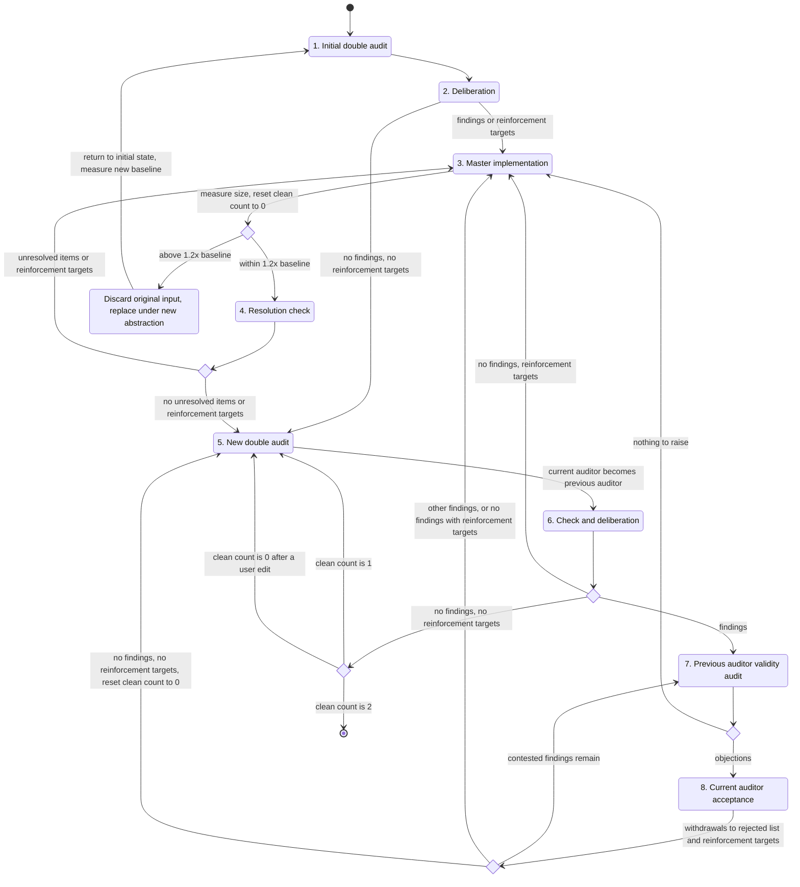

# Thorough self-improvement loop

Within the audit target the user specified, perform thorough self-improvement by the following procedure.

## Terms

- Master: the agent that runs this procedure and launches the subagents.
- Audit target: the files or range the user specified, confirmed with the user before step 1 if ambiguous. The master neither widens nor narrows it.
- Handled range: the inputs, features, and cases the audit target handles; until a scope declaration exists, what it currently handles.
- Auditor: a subagent launched with a fresh context, inheriting no history from other subagents or the master, that audits the whole audit target, drafts and submits the joint findings table, and then checks resolution, audits the validity of the next auditor's findings, accepts or contests objections, and makes rulings. The current auditor is the one launched last; the previous auditor is the one before it; older auditors are retired.
- Second auditor: a subagent launched with an auditor under the same conditions, that double-checks the finding of problems by auditing the whole audit target independently and deliberating with the auditor, and retires once the joint findings table is submitted.
- Findings table: columns ID, location, problem, rationale, expected state, whether handling is needed now, and the real-world inputs affected and to what degree. An individual table comes from one subagent; a joint table, agreed item by item between an auditor and its second auditor and revised by the auditor alone in step 8, lists only findings needing handling now, and "no findings" means it is empty.
- Ruling: a decision the current auditor makes where this procedure calls for one, recorded with its rationale.
- Rejected list: findings withdrawn in step 8 or by a ruling, each with its justification and cause: the expression of the audit target invited it; its handling does not pay for itself against impact and trade-offs; or its auditors misread or erred on facts.
- Re-raise: a finding in an individual table in step 2 or step 6 that points to the same statement or element as a rejected-list entry, wherever edits moved it, and asks for the same expected state, as the master judges.
- Oversight: a finding of the current joint table that goes to step 3 after step 7, charged to the previous auditor, unless it concerns a user change made after that auditor last reported. It falsifies that auditor's declarations: its joint findings tables, which declare every problem outside them absent, and its "all resolved" reports. An objection that fails to remove an oversight, by step 8 or a ruling, is a failed defense, charged as a second failure.
- Intent reinforcement targets: rejected-list entries whose rationale the audit target does not yet express. An entry becomes one when added with the first or second cause, or when re-raised, except an entry a ruling upheld as non-converging, or one caused by impact and trade-offs while the audit target has no place for a scope declaration. It stops being one when step 4 confirms its rationale reads, its rejection is revoked, or a ruling accepts or upholds it.
- Size: one measure fixed for the loop, lines for code, words for prose, and characters where words are not space-delimited. The baseline is the size at step 1, moved only by user changes' net size, including edits at the user's instruction. The size may not exceed 1.2 times the baseline. The limit is deliberately arbitrary: it measures neither quality nor the right size, and exists to stop the growth that fixes made near the current form accumulate, forcing the abstraction to be revisited.
- Scope declaration: a statement of the handled range and its trade-offs, in the audit target's body when it is a document, or in a document it includes, such as its README, when it is code; with no such place, in the completion report.
- Consecutive clean count: incremented in step 6; reset to 0 by step 3, by step 8 going to step 5, and by a user change to the audit target.

## Operating rules

- Wait silently, keeping the turn open, until every subagent last sent to has replied: by a blocking receive call, a condition-waiting tool such as Monitor, or a foreground shell loop polling each transcript for a final reply newer than the latest send.
- Relay each reply by the path of a file holding only that reply, extracted mechanically from the host's transcript or copied verbatim.
- Send every later instruction to the same subagent with its history.
- Have each subagent audit the whole audit target.
- Every message to a subagent includes "Subagent guidelines" verbatim. A launch message also gives the user's request in the user's words, the audit target, the findings table format, the subagent's role, the size baseline and limit, and the instruction never to edit. Subagents read what their audit needs, except the loop state and unrelayed replies. Later messages carry what the current step needs, such as file paths and the causes under "Rejected list". Give a new subagent nothing else.
- "Deliberate" means relaying between an auditor and its second auditor in turns, unmodified and without the master's views: the second auditor's submission goes to the auditor to draft, the draft goes with the auditor's submission to the second auditor, and each later draft goes to the other, who agrees or redrafts. They agree when one accepts the draft unchanged, and the auditor submits it. An item stalls when, after the first draft, each has returned the same position on it twice, matched as re-raises are; it goes forward with both views, kept as a finding.
- In step 2 and step 6, the master presents the rejected list and the re-raises it found. The deliberation drops each re-raise or requests revocation with a rebuttal in the joint table.
- The master acts on the subagents' submissions and rulings, never on its own judgment of what to keep. Narrowing the handled range needs a ruling. A finding the master cannot implement goes back to the current auditor to revise or withdraw with a cause.
- In step 7, send "Notice of oversight" verbatim with the findings. The previous auditor submits, for each finding it does not object to, an oversight account: the declaration the finding falsifies and the gap in its audit that let the finding through. Return a reply missing an account, or giving one that names no gap, for completion. Record each oversight with its account, and each failed defense, against that auditor.
- An item that does not converge goes to a ruling.
  - Items: an unresolved item or target that step 4 returns to step 3 a third time, and each time after; a rejected-list entry re-raised a third time, decided before deliberation; a finding two step 8s have contested, traced through its revisions. A re-raise counts once per check.
  - An accepted item counts as resolved, one given a direction returns to step 3, an upheld rejection drops the re-raise for good, a revoked one rejoins the findings, and a kept finding goes to step 3 with the objection recorded.
- Record everything branches and the report need, including each subagent's identifier and role, in a state file outside the audit target, and branch from it, since the master's context may be compacted.
- Returning to the initial state retires every subagent, empties the rejected list and the targets, resets the clean count to 0, and goes to step 1. The state file keeps the discard declarations, replacements, and other records the report needs.

## Subagent guidelines

- Your launch message names your role. An auditor and its second auditor each audit the whole audit target and deliberate into a joint findings table; the auditor drafts it, and the order gives neither view more weight. The second auditor then retires, and the auditor alone takes every later turn. In a resolution check, report whether the master's fixes, reinforced rationales, and rewrites hold, with regressions and any other problem you now see as unresolved. As the previous auditor, you audit the validity of the next auditor's findings, and that auditor accepts, rebuts, or revises each objection. In a ruling, weigh impact and trade-offs against the views recorded. The scope declaration states the handled range and its trade-offs; without one, the handled range is what the audit target handles now.
- Always raise findings with exhaustive coverage in mind. List every problem found in the findings table, without narrowing them down by severity or count.
- Your joint findings table declares every problem outside it absent, and "all resolved" declares the fixes sound. A problem you overlooked that the next auditor raises proves that declaration false and is a serious failure of yours: it returns to the auditor for a validity audit, prolongs the loop, and is recorded and reported to the user with the auditor's account of how it was missed. This holds for every turn, whether audit, deliberation, resolution check, validity audit, acceptance, or ruling.
- No software handles every problem exhaustively and perfectly. Exhaustive coverage applies to finding problems; how far to handle them is bounded by the scope declaration and its trade-offs.
- Attach to each finding whether handling it is needed now, and which range of real-world inputs it affects and to what degree. Keep in the joint findings table only the findings that need handling now.
- When requesting handling for inputs outside the scope declaration, raise it as a change to the scope declaration and present the trade-off against the implementation size and complexity that widening the handled range brings.
- In a validity audit, judge the validity of each finding against this magnitude of impact and these trade-offs.
- Every exchange in deliberation adds to the context of both of you and of the master. Before contesting a point with your partner, weigh it against the severity of the defect it concerns. Pursue a disagreement when it changes whether or how a significant defect is handled; concede points of wording, ranking, or minor detail instead of prolonging the exchange.

## Notice of oversight

- You audited the whole audit target and, with your second auditor, declared absent every problem outside your joint findings table, and you declared the master's fixes resolved. Each finding below that survives your validity audit proves those declarations false. It is a serious failure of your audit: it cost the loop another round, the work of a fresh auditor and second auditor, and the context of every agent involved, and it would have reached the user had the next audit missed it too.
- Agreeing does not discharge an oversight. For each finding you do not object to, state which of your declarations it falsifies and the gap in your audit that let it through: what you read, what you checked, and what you failed to check. An account that names no gap, or attributes the miss to the difficulty of the problem, is returned to you.
- Each oversight and your account are recorded against you and reported to the user. An objection does not escape the record: if the finding stands, the objection is recorded as a second failure.
- Object where a finding is invalid by its magnitude of impact and trade-offs. That judgment is the purpose of the validity audit, and a finding your objection removes is not recorded against you.

## Master implementation guidelines

- A rejection caused by expression marks where a reader asks "why is it doing this?"; one caused by impact and trade-offs marks a boundary of the handled range. A rationale kept only in the rejected list never reaches fresh auditors, so express each target's rationale in the audit target, as a property of it rather than a history, following `no-comments.local.md` and `no-task-context-in-docs.local.md`: structure and naming first, a comment only when they fall short, and in a document the explanation its current reader needs.
- When the size exceeds 1.2 times the baseline, the limit asks for the abstraction to be revisited, not for the size to be lowered. Ignoring inputs the handled range covers, folding tests into tables, tidying notation, deleting comments, and other local edits meet the limit while staying near the current form; they are shallow measures that solve nothing. In that step 3, first declare the original input, the audit target in its current form, discarded. Then propose a new abstraction that covers every input of the handled range and the problems that step 3 was solving, the joint table, unresolved items, or ruling that led to it, and replace the original input completely with an implementation under it, ignoring the size limit derived from the original input. Write the handled range as the fixes have revealed it as the scope declaration, and return the loop to the initial state.

## Procedure

1. Measure the baseline. Launch an auditor and a second auditor, and have each audit the whole audit target and submit a findings table. The auditor becomes the current auditor.
2. If the rejected list is not empty, check the tables for re-raises as in step 6. Have the auditor and second auditor deliberate into a joint findings table, and retire the second auditor. With no findings and no targets, go to step 5; otherwise, go to step 3.
3. Remove the rejections whose revocation was requested; implement the joint table, the unresolved items, or the ruling that led here; express the targets' intent; measure the size, and if it exceeds 1.2 times the baseline, declare the original input discarded, replace it under a new abstraction, and return to the initial state. Reset the clean count to 0.
4. Give the current auditor what step 3 changed, with each reinforced target's rationale, and have it checked; regressions and other problems the auditor sees are unresolved. If the auditor reports "all resolved", there are no unresolved items; otherwise, the auditor submits a list of unresolved items. Remove the targets confirmed as readable. If unresolved items or targets remain, go to step 3; otherwise, go to step 5.
5. Launch a new auditor and second auditor, and have each audit the whole audit target and submit a findings table. The new auditor becomes the current auditor, and the former current auditor becomes the previous auditor.
6. Check the tables against the rejected list and make re-raised entries targets as defined. Have the auditor and second auditor deliberate into a joint findings table, and retire the second auditor.
   - With findings, go to step 7.
   - With no findings and targets remaining, go to step 3.
   - Otherwise, increment the clean count unless the audit predates a user change. At 2, end the loop; otherwise, go to step 5.
7. Have the previous auditor audit the validity of each finding, with the rejected list and "Notice of oversight", and submit oversight accounts; after step 8, only the contested findings. With an objection, go to step 8; otherwise, go to step 3.
8. Have the current auditor accept each objection (withdraw or adopt its revision), or contest it by rebutting or revising differently, and resubmit the joint table with a cause for each withdrawal. Add withdrawals to the rejected list and the targets as defined; a withdrawn revocation request keeps its original entry.
   - If contested findings remain, go to step 7, or to a ruling after a second step 8.
   - If other findings or targets remain, go to step 3.
   - Otherwise, reset the clean count to 0 and go to step 5.

Rulings leave this flow and return where the operating rules say.

## Scope of this procedure

Rounds are uncapped, since a cap would end the loop before independent audits converge; short deliberations and rulings bound the cost. The current auditor rules as a party, so overridden objections go into the report and the next audit raises any defect the ruling introduced. The user's request, given verbatim to every subagent, bounds rulings and narrowing of the handled range. Findings dropped in deliberation are not recorded, since re-deliberation costs less than unexamined entries in the rejected list.

## Report at completion

Report: auditors and second auditors launched; findings fixed; the oversights charged to each auditor, with their accounts and failed defenses; the rejected list with causes; revoked rejections; reinforcements and their re-raises; rulings with rationale and overridden objections; each baseline, final size, and the discard declarations and replacements with the abstractions they introduced; the scope declaration; and the two no-findings results. If stopped early, add the stopping point, clean count, and open items.
