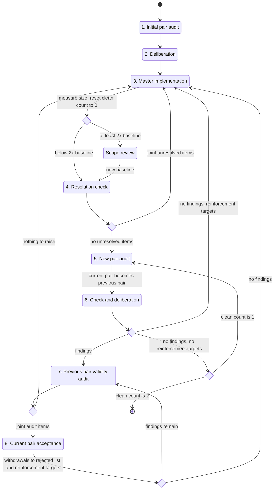

# Thorough self-improvement loop

Within the scope the user specified, perform thorough self-improvement by the following procedure.

## Terms

- Master: the agent that executes this procedure and launches the subagents.
- Audit target: the scope the user specified. The master neither widens nor narrows it.
- Pair: two subagents launched at the same time. The two are launched sharing no history with each other or with the master.
- Current pair: the pair launched in the most recent step 1 or step 5.
- Previous pair: the current pair immediately before a new pair is launched in step 5. When the new pair is launched, the former current pair becomes the previous pair, and any earlier previous pair is retired.
- Findings table: a table that records, for each finding, an ID, the location, the problem, the rationale, and the expected state.
- Joint: both subagents of a pair agree to every item of a submission.
- Rejected list: a list of the findings withdrawn in step 8, together with the joint audit results that justified the withdrawal. The master keeps it and carries it through the whole loop.
- Intent reinforcement targets: the findings in the rejected list whose rejection rationale the audit target does not yet express sufficiently. Findings newly rejected in step 8 and findings re-raised in step 6 fall into this category. Remove a finding once its intent has been expressed in step 3.
- Re-raise: a finding with the same content as a rejected finding appears in the individual findings table of either subagent in step 6, regardless of whether deliberation dropped it or requested revocation of the rejection.
- Implementation size: the size of the audit target. Decide at the start on a measure suited to the audit target, such as the number of non-blank lines for code or documents, and use the same measure throughout the loop.
- Baseline: the implementation size at the end of the first step 3. After a scope review, replace it with the implementation size after the review.
- Scope declaration: a statement, written in the audit target itself, of the boundary between the inputs the audit target handles and those it does not, together with the trade-offs behind that boundary.
- Consecutive clean count: the number of pairs that, in step 6 and with no fix in between, jointly reported no findings and produced no re-raise. It starts at 0 and returns to 0 every time a fix is implemented in step 3.

## Operating rules

- Wait for subagents silently by polling. Do not waste context by narrating progress or predicting results while waiting. Do not move to the next step until both results of a pair are in.
- Launch each subagent so that further instructions can be sent to it later with the same history, and record its identifier. Send every return to that same subagent through its identifier; never substitute a new subagent.
- Do not divide the audit. Have each of the two subagents in a pair audit the whole audit target.
- Give a newly launched subagent only the audit target and the user's requirements. Do not give it past findings tables, audit results, the rejected list, the master's views, or the consecutive clean count. Have the audit performed in this state.
- "Share within the pair" means passing one subagent's submission to the other without modification. The master repeats this exchange until the two views agree, then has the agreed result submitted jointly. The master adds none of its own views to what it relays.
- When sharing findings tables in step 2 and step 6, the master also presents the rejected list. For any finding with the same content as a rejected finding, the pair decides through deliberation whether to drop it from the findings table or to request revocation of the rejection. Have a finding whose rejection is to be revoked placed in the joint findings table with a rebuttal of the rejection rationale.
- The master acts according to joint submissions and does not keep or discard items on its own judgment. When cutting things in a scope review in step 3, reflect the cut in the scope declaration and have the current pair verify it in step 4.
- Include "Subagent guidelines" in the instructions every time a subagent is launched or a submission is returned to it.

## Subagent guidelines

- Always raise findings with exhaustive coverage in mind. List every problem found in the findings table, without narrowing them down by severity or count.
- In every turn, whether audit, deliberation, resolution check, validity audit, or acceptance, an oversight does not end with that turn. An overlooked problem will be raised by a later audit and returned to you for a validity audit or a resolution check. Because the loop does not end until new pairs jointly report no findings twice in a row, every oversight adds to your own work.
- No software handles every problem exhaustively and perfectly. Exhaustive coverage applies to finding problems; how far to handle them is bounded by the scope declaration and its trade-offs.
- Attach to each finding whether handling it is needed now, and which range of real-world inputs it affects and to what degree.
- When requesting handling for inputs outside the scope declaration, raise it as a change to the scope declaration and present the trade-off against the implementation size and complexity that widening the scope brings.
- In a validity audit, judge the validity of each finding against this magnitude of impact and these trade-offs.

## Master implementation guidelines

- A rejected finding marks a place where a reader of the audit target asks "why is it doing something like this?". A rationale kept only in the rejected list never reaches subagents that audit with a clean context. A re-raise is a defect: the audit target does not express its intent sufficiently.
- For each intent reinforcement target, express the rejection rationale in the audit target itself so that the next audit does not raise the same finding. Every re-raise sends deliberation, validity audit, acceptance, and reinforcement work back to the master.
- Choose the means of expression according to no-comments.local.md. Show intent first through structure and naming, and write a comment only when those are insufficient. For a document, write it in the body as an explanation the current reader needs.
- Do not write the history of findings or rejections in the reinforcement. Write the circumstance that justified the rejection as a property of the current audit target.
- Bound the growth of the audit target with a clear scope declaration and its trade-offs. After the first step 3, measure the implementation size and record it as the baseline. Measure the implementation size again at the end of every subsequent step 3.
- When the implementation size reaches twice the baseline, review the whole implementation scope within that step 3. For each feature and each handling, evaluate whether it is needed now and which range of real-world inputs it affects and to what degree, and cut what does not pay for itself. Write the remaining scope into the audit target as the scope declaration and present the trade-offs. Use the implementation size after the review as the new baseline.

## Procedure

1. Launch a pair, have each subagent audit the whole audit target, and have each submit a findings table. This pair becomes the current pair.
2. Share the two findings tables within the pair and have a joint findings table submitted.
3. The master implements fixes according to the joint findings table, or according to the joint list of unresolved items from step 4. If there are intent reinforcement targets, express their intent according to "Master implementation guidelines". Measure the implementation size, and review the implementation scope if it has reached twice the baseline. Reset the consecutive clean count to 0.
4. Return to both subagents of the current pair and have them check whether the findings are resolved. If intent was expressed in step 3, also have them check whether the rejection rationale can be read from the audit target. If the implementation scope was reviewed in step 3, also have them check whether the cut handling, the scope declaration, and the presented trade-offs are valid.
   - If both report "all resolved", go to step 5.
   - Otherwise, share their views on resolution within the pair and have a joint list of unresolved items submitted. If there are no unresolved items, go to step 5; otherwise, go to step 3.
5. Launch a new pair, have each subagent audit the whole audit target, and have each submit a findings table. This pair becomes the current pair, and the former current pair becomes the previous pair.
6. Before sharing, the master checks the two individual findings tables against the rejected list and adds re-raised findings to the intent reinforcement targets. Share the two findings tables within the pair and have a joint findings table submitted.
   - If there are findings, go to step 7.
   - If the joint result is no findings and there are intent reinforcement targets, go to step 3.
   - If the joint result is no findings and there are no intent reinforcement targets, increment the consecutive clean count by 1. If it has reached 2, end the loop; otherwise, go to step 5.
7. Return the joint findings table to both subagents of the previous pair and have them audit the validity of each finding.
   - If both report nothing to raise, go to step 3.
   - Otherwise, share the audit results within the pair and have a joint audit result submitted. If there is nothing to raise, go to step 3; otherwise, go to step 8.
8. Return the joint audit result to both subagents of the current pair and have them accept it. Share their acceptance results within the pair and have a joint findings table resubmitted. Add findings withdrawn in the resubmission to the rejected list and to the intent reinforcement targets, together with the audit results that justified the withdrawal. If a finding whose rejection revocation was requested remains in the resubmission, remove it from the rejected list and from the intent reinforcement targets. If findings remain, go to step 7; if there are no findings, go to step 3.

## Report at completion

When the loop ends, report the following to the user.

- The number of audit rounds (the number of pairs launched)
- The list of findings that were fixed
- The findings withdrawn in step 7 and step 8, with the reasons
- The places where intent was reinforced, and which of those findings were re-raised
- The implementation size measure, the initial baseline and the final implementation size, and the handling cut in scope reviews
- The final scope declaration and trade-offs
- The joint no-findings results of the two pairs that justified ending the loop
