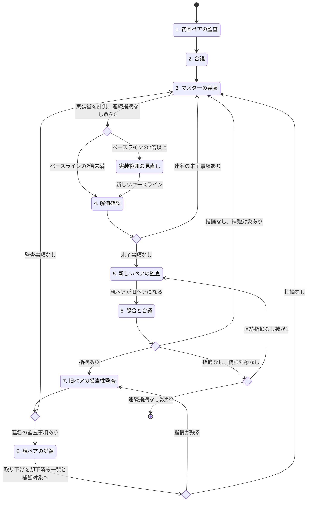

# 徹底した自己改善ループ

ユーザーが指示した範囲において、以下の手順で徹底した自己改善を行う。

## 用語

- マスター：この手順を実行し、サブエージェントを起動するエージェント。
- 監査対象：ユーザーが指示した範囲。マスターが広げたり狭めたりしない。
- ペア：同時に起動した2体のサブエージェント。2体は互いに、またマスターとも履歴を共有しない状態で起動する。
- 現ペア：直近の手順1または手順5で起動したペア。
- 旧ペア：手順5で新しいペアを起動する直前の現ペア。新しいペアの起動と同時にそれまでの現ペアが旧ペアになり、それ以前の旧ペアは役目を終える。
- 指摘表：指摘ごとに、ID、箇所、問題の内容、根拠、あるべき状態を記した表。
- 連名：ペアの2体が提出物の全項目に同意していること。
- 却下済み一覧：手順8で取り下げられた指摘と、その根拠となった連名の監査結果を記した一覧。マスターが保持し、ループ全体を通して引き継ぐ。
- 意図の補強対象：却下済み一覧の指摘のうち、却下の根拠を監査対象がまだ十分に表現していないもの。手順8で新たに却下された指摘と、手順6で蒸し返された指摘がこれにあたる。手順3で意図を表現したら外す。
- 蒸し返し：手順6で、いずれかのサブエージェントの個別の指摘表に、却下済みの指摘と同じ内容の指摘が現れること。合議で除かれたか、却下の取り消しを求めたかを問わない。
- 実装量：監査対象の規模。コードや文書なら空行を除いた行数のように、監査対象に適した尺度を最初に決め、ループ全体を通して同じ尺度で測る。
- ベースライン：最初の手順3を終えた時点の実装量。範囲の見直しを行ったら、見直し後の実装量で置き換える。
- 実装範囲の宣言：監査対象が扱う入力と扱わない入力の境界、およびその境界を選んだトレードオフを、監査対象自体に記述したもの。
- 連続指摘なし数：手順6で、修正を挟まずに連名で指摘なしとし、蒸し返しもなかったペアの数。初期値は0とし、手順3で修正を実装するたびに0へ戻す。

## 運用規則

- サブエージェントの待機はポーリングで黙って行う。待機中に経過の実況や結果の予想を出力してコンテキストを浪費しない。ペアの両方の結果が揃うまで次の手順へ進まない。
- サブエージェントは、同じ履歴のまま後から指示を送れる形で起動し、識別子を記録する。差し戻しはその識別子で同じサブエージェントへ送り、新しいサブエージェントで代用しない。
- 監査は分担させない。ペアの2体それぞれに監査対象の全体を監査させる。
- 新しく起動するサブエージェントには、監査対象とユーザーの要求だけを渡す。過去の指摘表、監査結果、却下済み一覧、マスターの見解、連続指摘なし数は渡さない。監査はこの状態で行わせる。
- 「ペアの間で共有させる」とは、一方の提出物を加工せずにもう一方へ渡すことである。両者の見解が一致するまでマスターが受け渡しを繰り返し、一致した結果を連名で提出させる。マスターは中継に自分の見解を加えない。
- 手順2と手順6で指摘表を共有させるときは、マスターが却下済み一覧も併せて提示する。却下済みの指摘と同じ内容の指摘について、指摘表から除くか、却下の取り消しを求めるかはペアが合議で決める。取り消しを求める指摘は、却下の根拠への反論を添えて連名の指摘表に載せさせる。
- マスターは連名の提出物に従って行動し、項目を自分の判断で取捨しない。手順3の範囲の見直しで削る場合は、実装範囲の宣言に反映し、手順4で現ペアの確認を受ける。
- サブエージェントを起動するとき、および差し戻すときは、毎回「サブエージェントの実施要項」を指示に含める。

## サブエージェントの実施要項

- 指摘は常に全網羅を念頭に挙げる。見つけた問題は、重要度や件数を理由に絞り込まず、すべて指摘表に載せる。
- 監査、合議、解消確認、妥当性監査、受領のどのターンでも、見逃しはそのターンで終わらない。見逃した問題は後続の監査で指摘され、自分に差し戻されて妥当性の監査や解消の確認を求められる。ループは新しいペアが2回連続で連名の指摘なしとするまで終わらないため、見逃すたびに自分の作業が増える。
- すべての問題に網羅的に、完璧に対応するソフトウェアは存在しない。全網羅は問題を見つけることについての要求であり、対応を無限に広げることを求めるものではない。
- 指摘には、その対応がいま必要か、現実の入力のうちどの範囲にどの程度の影響があるかを添える。
- 実装範囲の宣言の外にある入力への対応を求める場合は、範囲の宣言の変更として挙げ、範囲を広げることで生じる実装量や複雑さとのトレードオフを示す。
- 妥当性監査では、この影響の大きさとトレードオフに照らして指摘の妥当性を判断する。

## マスターの実装要項

- 却下された指摘は、監査対象を読んだ者が「なぜこのようなことをしているのか」と問う箇所を示している。却下の根拠を却下済み一覧に置くだけでは、クリーンコンテキストで監査するサブエージェントには届かない。蒸し返しは、監査対象の意図の表現が足りないという欠陥である。
- 意図の補強対象ごとに、却下の根拠を監査対象自体に表現し、次の監査で同じ指摘が挙がらないようにする。蒸し返されるたびに、合議、妥当性監査、受領、補強の作業がマスターに返ってくる。
- 表現の手段は no-comments.local.md に従う。まず構造と命名で意図を示し、それで足りない場合にだけコメントを書く。文書であれば、現在の読者が必要とする説明として本文に書く。
- 補強の記述には、指摘や却下の経緯を書かない。却下の根拠となった事情そのものを、現在の監査対象の性質として書く。
- 必要なのは無限の膨張ではなく、明確な実装範囲の宣言とトレードオフの提示である。最初の手順3を終えたら実装量を測り、ベースラインとして記録する。以降も手順3を終えるたびに実装量を測る。
- 実装量がベースラインの2倍に達したら、その手順3のうちに実装範囲の全体を見直す。個々の機能と対応について、いま必要か、現実の入力のうちどの範囲にどの程度の影響があるかを評価し、見合わないものを削る。残した範囲を実装範囲の宣言として監査対象に書き、トレードオフを示す。見直し後の実装量を新しいベースラインとする。

## 手順

1. ペアを起動し、それぞれに監査対象の全体を監査させ、指摘表を提出させる。このペアが現ペアになる。
2. 2つの指摘表をペアの間で共有させ、連名の指摘表を提出させる。
3. 連名の指摘表、または手順4の連名の未了事項に従い、マスターが修正を実装する。意図の補強対象があれば、「マスターの実装要項」に従って意図を表現する。実装量を測り、ベースラインの2倍に達していれば実装範囲を見直す。連続指摘なし数を0に戻す。
4. 現ペアの2体に差し戻し、指摘が解消したかを確認させる。手順3で意図を表現した場合は、却下の根拠が監査対象から読み取れるかも確認させる。手順3で実装範囲を見直した場合は、削った対応と実装範囲の宣言、示したトレードオフが妥当かも確認させる。
   - 両者が「すべて解消」とした場合、手順5へ進む。
   - それ以外の場合、解消状況の見解をペアの間で共有させ、連名で未了事項を提出させる。未了事項がなければ手順5へ、あれば手順3へ進む。
5. 新しいペアを起動し、それぞれに監査対象の全体を監査させ、指摘表を提出させる。このペアが現ペアになり、直前の現ペアが旧ペアになる。
6. 共有の前に、マスターが2つの個別の指摘表を却下済み一覧と照合し、蒸し返された指摘を意図の補強対象に加える。2つの指摘表をペアの間で共有させ、連名の指摘表を提出させる。
   - 指摘がある場合、手順7へ進む。
   - 連名で指摘なしとなり、意図の補強対象がある場合、手順3へ進む。
   - 連名で指摘なしとなり、意図の補強対象がない場合、連続指摘なし数を1増やす。連続指摘なし数が2に達したらループを終了し、達していなければ手順5へ進む。
7. 連名の指摘表を旧ペアの2体に差し戻し、各指摘の妥当性を監査させる。
   - 両者が監査事項なしとした場合、手順3へ進む。
   - それ以外の場合、監査結果をペアの間で共有させ、連名で監査結果を提出させる。監査事項がなければ手順3へ、あれば手順8へ進む。
8. 連名の監査結果を現ペアの2体に差し戻し、受領させる。受領結果をペアの間で共有させ、連名で指摘表を再提出させる。再提出で取り下げられた指摘は、根拠となった監査結果とともに却下済み一覧と意図の補強対象へ加える。却下の取り消しを求めた指摘が再提出に残った場合は、却下済み一覧と意図の補強対象から外す。指摘が残る場合は手順7へ、指摘なしの場合は手順3へ進む。

## 終了時の報告

ループを終了したら、ユーザーに次を報告する。

- 監査の巡回数（起動したペアの数）
- 修正した指摘の一覧
- 手順7と手順8で取り下げられた指摘とその理由
- 意図を補強した箇所と、そのうち蒸し返された指摘
- 実装量の尺度、最初のベースラインと最終の実装量、実装範囲の見直しで削った対応
- 最終的な実装範囲の宣言とトレードオフ
- 終了の根拠となった2つのペアの連名の指摘なし
